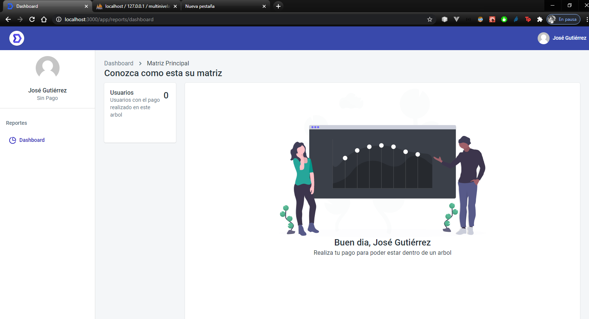

This project was bootstrapped with [Create React App](https://github.com/facebook/create-react-app).

## Available Scripts

In the project directory, you can run:

### `npm start` or `yarn start`

Runs the app in development mode. 
Open [http://localhost:3000](http://localhost:3000) to view it in the browser.

The page will automatically reload if you make changes to the code. 
You will see the build errors and lint warnings in the console.

### `Procedimiento para deploy`

<ol>
    <li>Definir variables de entorno .env de forma correcta, probar con postman si responde API. <strong>REACT_APP_URL=http://localhost/multinivel</strong></li>
    <li>Borrar el derectorio build y realizar npm run build de nuevo.</li>
    <li>Revisar en proyecto de backend(multinivel) el require de cada una de las clases</li>
    <li>Resetear autoincrements de tablas usuarios y arbol con <strong>ALTER TABLE usuarios AUTO_INCREMENT = 1</strong></li>
    <li>Registrar un primer usuario en la DB con el formulario de registro</li>
    <li>Insertar manualmente el primer usuario en la tabla arbol</li>
</ol>

[Read more about this template.](https://material-ui.com/store/items/devias-kit-pro/)
